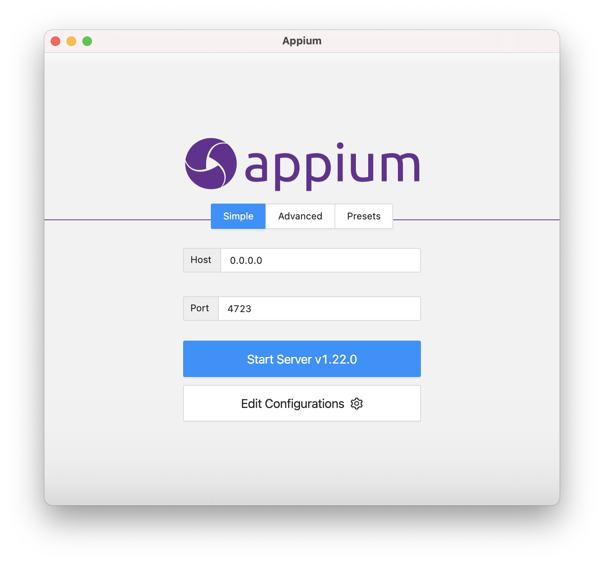

# Appium

## What is Appium?

Appium is a software suite for automating testing of mobile applications. It is
developed by Sauce Labs.

[Appium website](https://appium.io)

## How does Appium work?

At the core of Appium is the Appium Server, which is a service which is able to
bridge the Node runtime where the Appium script is running with the automation
side where the emulated or attached application is being controlled.

Appium Desktop is a UI for Appium Server, allowing the user to start it up, shut
it down and configure its options.

Appium Inspector is a GUI for inspecting the component structure of a given
application, which assists during the automation script development process.

A library of the user's choice can be used to provider various other functions
on top of the Appium layer, such as assertions.

## Installation and initial setup

### [Appium Desktop](https://github.com/appium/appium-desktop)

Appium Desktop includes Appium Server.

Go to [the latest release of Appium Desktop][appium-desktop-latest].

[appium-desktop-latest]: https://github.com/appium/appium-desktop/releases/latest

Download whichever format of the file for macOS you prefer. In any case, on Big
Sur, permissions need to be adjusted to make the application runnable.

Find the Downloads directory in Finder and go up using Go > Enclosing Folder in
the Finder menu. Right-click on Downloads and select New Terminal at Folder.

In the Terminal window, type `xattr -cr Appium-Server-GUI-mac` and press Tab to
auto-complete the file name with the latest version in it. Run this command and
close Terminal. Now the downloaded file will be runnable. This is required as
macOS Big Sur uses Gatekeeper to check the signatures of downloaded applications
and the Appium Desktop app is not signed using a paid developer certificate.

More about this in [this Appium Desktop readme section][appium-desktop-macos].

[appium-desktop-macos]: https://github.com/appium/appium-desktop#installing-on-macos

Open and install Appium Desktop from the downloaded file. For DMG, this means
opening the DMG by double-click and dragging the Appium Desktop icon to the
Applications icon.

Once installed, Appium Desktop will be found in Applications and can be run and
pinned to the Dock.

Run Appium Desktop and click Start Server to start Appium Server:

### [Appium Inspector](https://github.com/appium/appium-inspector)

https://github.com/appium/appium-inspector/releases/latest
